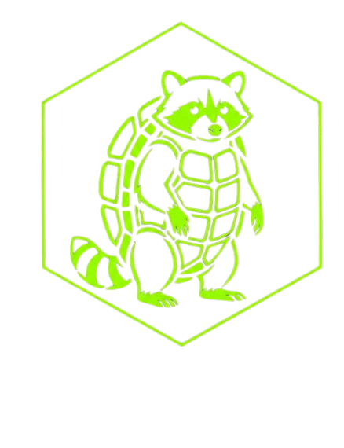
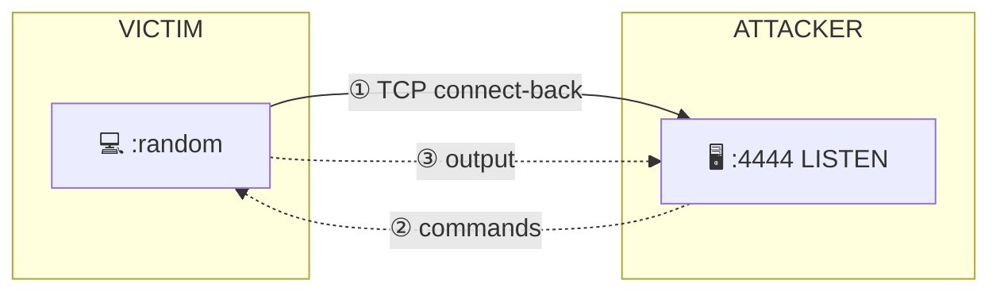
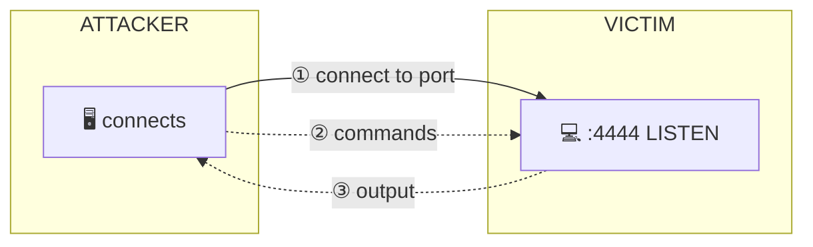
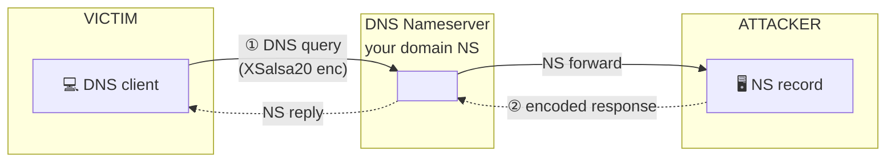
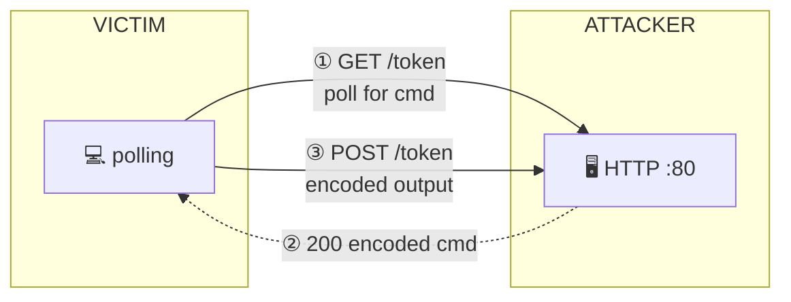
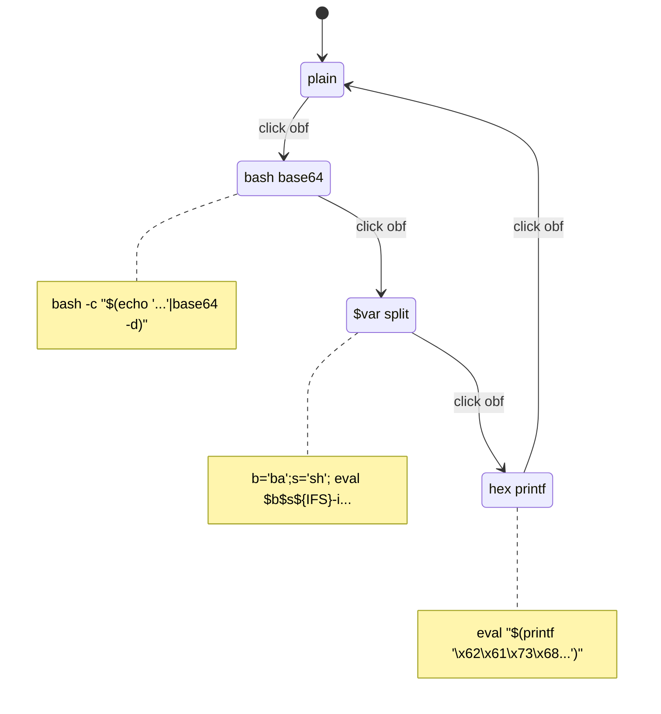
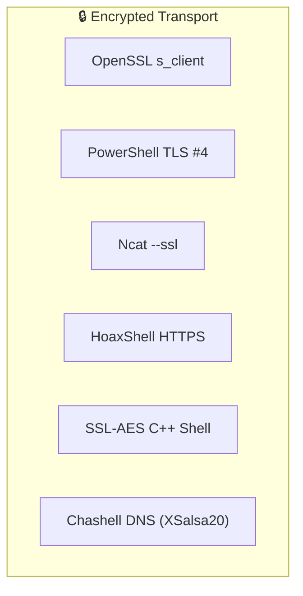
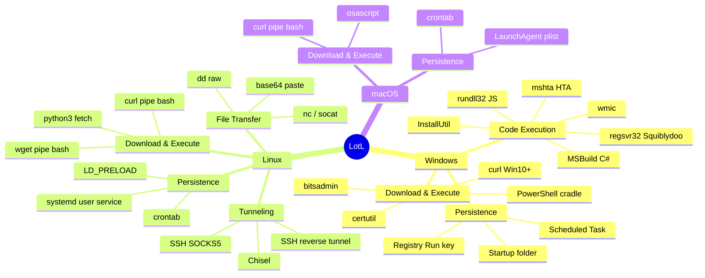
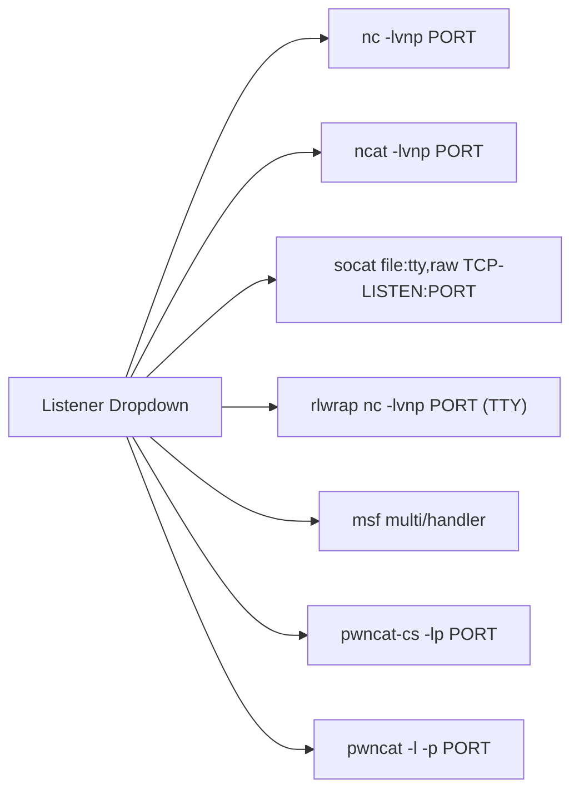

<p align="center">
  
</p>

<h1 align="center">RaccShells</h1>
<p align="center">
  <strong>Self-contained reverse shell generator · zero dependencies · single HTML file</strong><br/>
  <sub>For authorised penetration testing and CTF use only</sub>
</p>

<p align="center">
  
  
  
  
</p>

---

## What is it?

RaccShells is a **self-contained, single-file** reverse shell reference tool. Open `index.html` — no server, no install, no internet required. Enter your IP and port, copy the shell, and go.

Built with a dark terminal aesthetic: scanline overlay, matrix green, monospace everything.

---

## Feature Overview

<p align="center">
  
</p>

| Tab | Contents |
|-----|----------|
| **Reverse Shells** | 72 shells across Bash, Python, Perl, PHP, Ruby, PowerShell, Java, Go, Lua, Awk, … |
| **Bind Shells** | 14 bind-side listeners |
| **MSFVenom** | 25 ready-to-paste msfvenom payloads |
| **Shell Upgrade** | TTY spawn, stty raw, socat fully interactive, escape binaries |
| **Tools & Listeners** | pwncat-cs, pwncat (cytopia), Chashell, HellShell, SSL-AES, FuegoShell, CHAOS RAT, tmate |
| **Living off the Land** | Windows (LOLBAS) + Linux + macOS — download, exec, persistence, tunnel |

---

## Traffic Flow Diagrams

Every shell shows an animated SVG diagram when expanded — no static images, generated inline.

```mermaid
flowchart LR
    subgraph VICTIM
        V["💻 :random"]
    end
    subgraph ATTACKER
        A["🖥 :443 LISTEN"]
    end

    V -- "① TLS handshake" --> A
    A -- "② 🔒 encrypted cmd" --> V
    V -- "③ 🔒 encrypted output" --> A

    style A fill:#1a1200,stroke:#cc9900
    style V fill:#1a0000,stroke:#ff4444
```











---

## Shell Obfuscation

Each shell that contains an interpreter supports **dynamic obfuscation** — click `▶ obf` to cycle modes without leaving the page.



**Obfuscation modes per interpreter:**

| Interpreter | Modes |
|------------|-------|
| Bash / Zsh / Sh | `base64` · `$var split` · `hex printf` |
| PowerShell | `-EncodedCommand` (UTF-16LE) · `[char[]]` IEX |
| Python | `exec(base64.b64decode(...))` |
| Perl | `eval(pack('H*', hex))` |
| PHP | `eval(base64_decode(...))` |
| Ruby | `eval(Base64.decode64(...))` |

---

## Encrypted Shells

Shells with encrypted transport are highlighted in **gold** and carry a 🔒 badge.



Use the **🔒 encrypted** filter chip to show only these shells.

---

## Living off the Land

Techniques organised by OS, each with its own filter view.



---

## Tools & Listeners

| Tool | Type | Platform |
|------|------|----------|
| [pwncat-cs](https://github.com/calebstewart/pwncat) | Post-exploitation platform | Linux |
| [pwncat (cytopia)](https://github.com/cytopia/pwncat) | Netcat on steroids | Linux / Mac / Win |
| [Chashell](https://github.com/kost/chashell) | DNS reverse shell | All |
| [HellShell](https://github.com/NUL0x4C/HellShell) | Shellcode obfuscator | Windows |
| [SSL-AES Reverse Shell](https://github.com/V-i-x-x/SSL-AES-Reverse-Shell) | TLS C++ shell | Windows |
| [FuegoShell](https://github.com/v1k1ngfr/fuegoshell) | SMB named-pipe shell | Windows |
| [CHAOS RAT](https://github.com/tiagorlampert/CHAOS) | Go RAT with web UI | Linux / Win |
| [tmate](https://github.com/tmate-io/tmate) | Terminal sharing via SSH | Linux / Mac |

---

## Usage

```bash
# Option 1 — open directly in browser (no server needed)
open index.html   # macOS
start index.html  # Windows
xdg-open index.html  # Linux

# Option 2 — serve locally
python3 -m http.server 8080
# → http://localhost:8080
```

1. Set **LHOST / IP**, **PORT**, and preferred **shell binary**
2. Pick a **listener** from the dropdown — the attacker-side command auto-updates
3. Use the **filter chips** to narrow by OS, encryption, or obfuscation support
4. Click a shell to expand — diagram animates, copy button is ready
5. Optionally click **▶ obf** to cycle through obfuscation modes before copying

---

## Listener Dropdown



